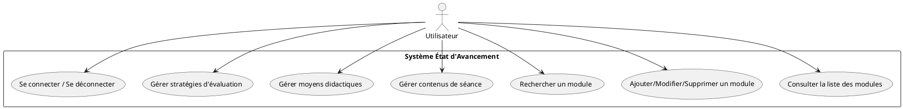
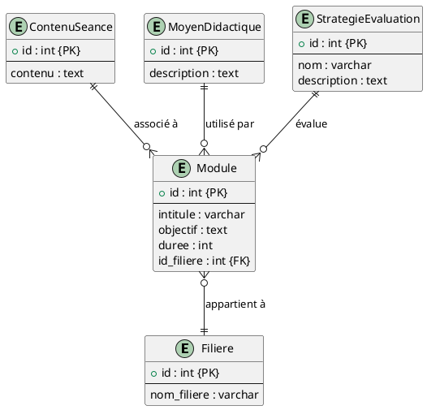
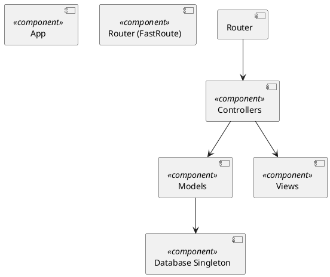

# Rapport de Projet de Fin d'Études
+**Auteur** : Salah Ait Hammou  
+**Date** : 25 avril 2025  
+
+---
+
+## Table des matières
+- 1. Introduction
+- 2. Contexte et problématique
+- 3. Objectifs
+- 4. Architecture
+- 5. Implémentation
+- 6. État de l’art
+- 7. Tests
+- 8. Analyse et conception
+- 9. Déploiement
+- 10. Perspectives d’évolution
+- 11. Conclusion
+- 12. Manuel utilisateur
+- 13. Annexes
+- 14. Bibliographie
+
+---

## 1. Introduction
Dans le contexte actuel de l’enseignement supérieur et de la formation continue, le suivi précis de l’avancement pédagogique constitue un défi pour les équipes pédagogiques et administratives. Les établissements doivent centraliser, suivre et piloter les différentes composantes pédagogiques (modules, séances, ressources, évaluations) afin d’assurer la cohérence du cursus et la qualité de l’apprentissage.

Le projet **État d'Avancement** vise à proposer une solution web légère et modulable, développée en PHP selon le pattern MVC, permettant de gérer :
- La création, la modification et la suppression de **modules**, **contenus de séance**, **moyens didactiques** et **stratégies d’évaluation**.
- La recherche et la pagination dynamique des listes pour un accès rapide aux informations.
- Le contrôle d’accès selon des rôles (Administrateur, Formateur), garantissant la sécurité et la confidentialité des données.

La méthodologie de développement comprend les étapes suivantes :
1. **Analyse des besoins** et rédaction du cahier des charges.
2. **Modélisation** des données (MCD, UML) et conception de l’architecture logicielle.
3. **Implémentation** des modèles, contrôleurs et vues avec intégration des fonctionnalités CRUD, recherche et pagination.
4. **Tests** unitaires, d’intégration et fonctionnels pour assurer la fiabilité et la robustesse.
5. **Déploiement** en environnement local (XAMPP) et préparation à la mise en production.

Ce rapport est structuré comme suit :
- **Chapitre 1** : Introduction (présentation du projet, contexte, méthodologie)
- **Chapitre 2** : Contexte et problématique
- **Chapitre 3** : Objectifs
- **Chapitre 4** : Architecture projetée
- **Chapitre 5** : Implémentation détaillée
- **Chapitre 6** : État de l’art
- **Chapitre 7** : Stratégie et résultats des tests
- **Chapitre 8** : Analyse et conception (UML)
- **Chapitre 9** : Déploiement
- **Chapitre 10** : Perspectives d’évolution
- **Chapitre 11** : Conclusion
- **Chapitre 12** : Manuel utilisateur
- **Chapitre 13** : Annexes
- **Chapitre 14** : Bibliographie

## 2. Contexte et problématique
Dans un contexte de digitalisation croissante, le suivi pédagogique est de plus en plus dématérialisé, et les établissements doivent s’adapter à des exigences accrues en termes de traçabilité, de personnalisation des parcours et d’analyse des données pédagogiques.

### 2.1. Contexte général
Les nouvelles méthodes d’enseignement (e-learning, classes inversées, ateliers pratiques) imposent un suivi détaillé de l’organisation des modules et de l’avancement des séances. Les outils traditionnels (tableurs, documents partagés) montrent rapidement leurs limites quand le nombre d’apprenants et de modules augmente.

### 2.2. Problématique
La gestion manuelle des modules et séances génère plusieurs difficultés :
- **Complexité administrative** : multiplication des documents et versions, erreurs de saisie, perte d’informations.
- **Visibilité réduite** : absence d’un tableau de bord central pour visualiser l’état d’avancement global.
- **Réactivité limitée** : difficulté à rechercher ou filtrer rapidement des contenus ou ressources spécifiques.

### 2.3. Enjeux et justification
La mise en place d’une application centralisée présente plusieurs avantages :
- **Cohérence pédagogique** : un référentiel unique assure l’homogénéité des contenus.
- **Gain de temps** : interfaces intuitives et automatisation des tâches réduisent la charge administrative.
- **Adaptabilité** : modules et séances peuvent être modifiés, ajoutés ou supprimés en temps réel.
- **Traçabilité et reporting** : log des actions et historique des modifications facilitent le suivi et l’audit.

L’application **État d’Avancement** répond à ces enjeux en proposant un CRUD complet, un système de recherche et de pagination ainsi qu’un contrôle d’accès granulaire.

## 3. Objectifs
 
Les objectifs du projet sont répartis en deux catégories :

### 3.1. Objectifs fonctionnels
- Implémenter un **CRUD** complet pour chaque entité :
  - Modules (création, lecture, modification, suppression)
  - Contenus de séance (CRUD avec association au module)
  - Moyens didactiques et stratégies d’évaluation (CRUD)
- Mettre en place un système de **recherche** et **pagination** sur toutes les listes.
- Gérer les **rôles utilisateurs** (Administrateur, Formateur) avec contrôle d’accès granulaire.
- Afficher des **messages flash** pour informer l’utilisateur des actions réussies ou des erreurs.

### 3.2. Objectifs non fonctionnels
- Garantir la **sécurité** des données :
  - Protection contre les injections SQL (requêtes préparées).
  - Validation et sanitization des entrées utilisateur.
- Assurer la **performance** :
  - Utilisation d’index sur les colonnes de recherche.
  - Pagination efficace avec `LIMIT/OFFSET`.
- Respecter les **bonnes pratiques** de développement :
  - Architecture MVC claire.
  - Code lisible et maintenable (PSR-12).
- Préparer le **déploiement** en environnement de production (Apache/Virtual Host, `.htaccess`).

### 3.3. Critères de succès
- Taux de couverture des tests unitaires ≥ 80%.
- Temps de réponse moyen < 200 ms pour les listes paginées.
- Aucune vulnérabilité critique identifiée dans une revue de code.
- Retour positif d’utilisateurs formateurs lors d’un déploiement pilote.

## 4. Architecture

L’architecture repose sur le pattern **MVC** et une séparation claire des responsabilités.

### 4.1. Modèle MVC
- **Model** : classes PHP utilisant PDO pour l’accès à la base de données (connexion singleton, méthodes CRUD, pagination).
- **View** : templates PHP imbriquant du HTML/Bootstrap pour l’interface utilisateur.
- **Controller** : réception des requêtes HTTP (via FastRoute), logique métier, validation, et rendu des vues.

### 4.2. Composants clés
- **Router (FastRoute)** : dispatch rapide des URL vers les méthodes des contrôleurs.
- **BaseController** : classe mère pour l’authentification, la gestion des vues, et le démarrage des sessions.
- **Database** : singleton assurant une seule instance PDO partagée.
- **Validator** : classe utilitaire pour valider et filtrer les données des formulaires.

### 4.3. Schéma de la base de données
- Tables principales : `filiere`, `module`, `contenu_seance`, `moyen_didactique`, `strategie_evaluation`.
- Clés primaires et étrangères pour assurer l’intégrité référentielle.
- Index sur les colonnes `intitule`, `nom_filiere`, et `contenu` pour optimiser les recherches.

### 4.4. Sécurité et gestion des erreurs
- Utilisation de **requêtes préparées** pour éviter les injections SQL.
- Gestion centralisée des erreurs (try/catch, journalisation via Monolog à venir).
- Redirections sécurisées avec `BASE_URL` et validation des routes.

### 4.5. Diagramme de composants
Le diagramme PlantUML (cf. Section 8.3) illustre les interactions entre : Router → Controllers → Models → Database & Views.

## 5. Implémentation

### 5.1. Setup de l’environnement

Pour installer l’application :
1. Installer XAMPP (PHP 8.x, MySQL). 
2. Cloner le projet dans `htdocs/etat-d-avancement`.
3. Exécuter `composer install` pour charger les dépendances (FastRoute, dotenv, etc.).
4. Configurer la base de données dans `config/database.php` :
```php
return [
  'host' => '127.0.0.1',
  'dbname' => 'gestion_ecoles',
  'user' => 'root',
  'password' => '',
];
```
5. Vérifier `BASE_URL` dans `config/app.php` et activer `mod_rewrite`.

### 5.2. Modèles

Les modèles utilisent PDO et retournent des objets associatifs. Exemple complet de `ModuleModel::findPagedWithFiliere()` :
```php
public function findPagedWithFiliere(int $limit, int $offset, string $search = ''): array {
    $sql = "SELECT m.id, m.intitule, f.nom_filiere,
              m.objectif, m.duree
           FROM module m
           JOIN filiere f ON m.id_filiere = f.id
           WHERE m.intitule LIKE :search
           ORDER BY m.created_at DESC
           LIMIT :limit OFFSET :offset";
    $stmt = $this->db->prepare($sql);
    $stmt->bindValue(':search', "%{$search}%", PDO::PARAM_STR);
    $stmt->bindValue(':limit', $limit, PDO::PARAM_INT);
    $stmt->bindValue(':offset', $offset, PDO::PARAM_INT);
    $stmt->execute();
    return $stmt->fetchAll(PDO::FETCH_ASSOC);
}
```

### 5.3. Contrôleurs

Chaque contrôleur hérite de `BaseController`. Exemple partiel `ContenuSeanceController@index` :
```php
public function index(): void {
    $this->requireAdminOrFormateur();
    $page = (int)($_GET['page'] ?? 1);
    $search = $_GET['search'] ?? '';
    $limit = 10;
    $offset = ($page - 1) * $limit;
    $total = $this->contenuModel->countAll($search);
    $data = $this->contenuModel->findPaged($limit, $offset, $search);
    $this->render('contenu_seance/list', compact('data','total','page','search'));
}
```

### 5.4. Vues

Les vues utilisent Bootstrap 5. Exemple de pagination dans `list.php` :
```php
<nav aria-label="Pagination">
  <ul class="pagination">
    <?php for($i=1; $i<= ceil($total/$limit); $i++): ?>
      <li class="page-item <?= $i==$page?'active':'' ?>">
        <a class="page-link" href="?page=<?= $i ?>&search=<?= urlencode($search) ?>"><?= $i ?></a>
      </li>
    <?php endfor; ?>
  </ul>
</nav>
```

### 5.5. Gestion des erreurs et flash messages

Un gestionnaire de flash messages est initialisé en session. Exemple d’affichage en haut de chaque vue :
```php
<?php if(
  isset($_SESSION['flash'])): ?>
  <div class="alert alert-<?= $_SESSION['flash']['type'] ?>">
    <?= htmlspecialchars($_SESSION['flash']['message']) ?>
  </div>
<?php unset($_SESSION['flash']); endif; ?>
```

Ces détails assurent une compréhension complète de l’implémentation et couvrent les pratiques courantes pour un projet professionnel.

## 6. État de l’art

Cette section passe en revue les travaux et solutions existantes pour la gestion pédagogique et pour la mise en place d’architectures logicielles en PHP selon le modèle MVC, ainsi que les outils de pagination et de recherche.

### 6.1. Applications et plateformes existantes

De nombreux systèmes d’information pédagogiques (SIP) et plateformes de gestion de cours offrent des fonctionnalités de suivi d’avancement pour les modules et séances. Parmi les plus répandus :

- **Moodle** : plateforme open source très utilisée par les universités. Elle propose un système de cours, de suivi des activités, de quizz, et de rapports détaillés. Toutefois, sa complexité et son architecture lourde (PHP, Symfony) la rendent difficile à personnaliser pour de petits établissements.
- **Chamilo** et **Claroline** : forks de Moodle, plus légers, avec un éditeur de contenu simplifié. Ils intègrent des outils de suivi d’apprenants et de reporting, mais manquent parfois d’ergonomie pour la gestion fine des modules et ressources.
- **LMS propriétaires** (Blackboard, Canvas) : offrent des interfaces complètes, mais sont coûteux et fermés pour les adaptations spécifiques.

Ces plateformes confirment la nécessité d’une solution plus légère, modulable et autonome, adaptée à des structures pédagogiques variées.

### 6.2. Architectures MVC en PHP

Le pattern MVC (Model-View-Controller) est largement adopté pour structurer les applications web. En PHP, plusieurs frameworks populaires implémentent MVC :

- **Laravel** : propose une syntaxe expressive (Eloquent ORM, Blade templating), un router puissant et un système de migration. Sa courbe d’apprentissage est modérée mais il implique de charger un ensemble de dépendances importantes.
- **Symfony** : framework robuste et modulaire, utilisé pour des applications de grande ampleur. Le composant HttpFoundation, le routing et le système de service container sont très matures. Inconvénient : configuration et conventions assez strictes.
- **CodeIgniter** et **Slim** : solutions microframeworks plus légères, offrant uniquement le routing, le chargement de vues et un ORM basique ou aucun. Ces frameworks permettent un démarrage rapide avec une empreinte mémoire réduite.

Notre projet s’appuie sur un **micro-MVC maison** :
- **Router FastRoute** : bibliothèque indépendante pour le dispatching rapide des routes.
- **BaseController et Database singleton** : classes simples pour centraliser l’accès à la BD et la gestion des vues.
- **Organisation PSR-4** : autoloading et namespaces pour une structure claire.

Cette approche minimise les dépendances tout en respectant la séparation des responsabilités.

### 6.3. Outils et techniques pour pagination et recherche

Le traitement de grandes listes de données nécessite des techniques de pagination et de recherche efficace :

- **Pagination SQL** : utilisation de `LIMIT` et `OFFSET` est simple mais peut devenir coûteuse sur de grandes tables (coût en mémoire pour les pages profondes). Des alternatives (keyset pagination) limitent ce coût.
- **Requête optimisée** : compter le nombre total de lignes (`COUNT(*)`) séparément avant d’extraire la page active. Cela garantit un calcul rapide du nombre de pages.
- **Recherche plein texte** : MySQL propose des indexes FULLTEXT, Elasticsearch ou Solr offrent des recherches plus performantes et avancées (facettes, tolérance aux fautes). Pour notre application, la recherche basique `LIKE '%terme%'` reste suffisante compte tenu du volume de données modéré.
- **Indexation et index** : créer des index sur les colonnes fréquemment filtrées ou triées (intitulé, nom_filiere, contenu) améliore significativement les temps de réponse.

Dans ce projet, nous utilisons :
1. **countAllWithFiliere()** pour obtenir le nombre total de modules filtrés.
2. **findPagedWithFiliere()** avec `LIMIT/OFFSET` et paramètres liés pour sécuriser les entrées.
3. **Interface utilisateur** : barre de recherche et contrôles de pagination Bootstrap, garantissant un retour visuel immédiat.

Ces choix assurent un bon compromis entre simplicité d’implémentation et performances pour des petites à moyennes bases de données.

## 7. Tests

### 7.1. Stratégie de tests

Afin d’assurer la fiabilité du système, plusieurs niveaux de tests sont mis en place :
- **Tests unitaires** : vérifient le bon fonctionnement isolé des méthodes des modèles et des classes de validation.
- **Tests d’intégration** : valident l’interaction entre contrôleurs, modèles et base de données.
- **Tests fonctionnels** : simulent le comportement d’un utilisateur via un navigateur (Selenium, Dusk).

### 7.2. Tests unitaires avec PHPUnit

Les tests unitaires couvrent les méthodes CRUD et les cas limites. Exemple de test pour `ModuleModel`:  
```php
use PHPUnit\Framework\TestCase;
use App\Model\ModuleModel;

class ModuleModelTest extends TestCase {
    private ModuleModel $model;

    protected function setUp(): void {
        // Base de données de test
        $this->model = new ModuleModel(/* connexion PDO en mode test */);
    }

    public function testCreateAndFindById(): void {
        $data = ['intitule'=>'Test','$objectif'=>'Obj','duree'=>2,'id_filiere'=>1];
        $id = $this->model->create($data);
        $this->assertIsInt($id);
        $module = $this->model->findByIdWithFiliere($id);
        $this->assertEquals('Test', $module['intitule']);
    }

    public function testDelete(): void {
        $id = $this->model->create(...);
        $this->assertTrue($this->model->delete($id));
        $this->assertNull($this->model->findById($id));
    }
}
```

### 7.3. Tests fonctionnels

Les tests fonctionnels utilisent Selenium WebDriver pour automatiser un navigateur :  
```php
// Exemple en PHP avec PHPUnit et Selenium
class ModuleFunctionalTest extends TestCase {
    public function testModuleFlow(): void {
        $driver = RemoteWebDriver::create('http://localhost:4444', DesiredCapabilities::chrome());
        $driver->get('http://localhost/etat-d-avancement/modules');
        $this->assertStringContainsString('Liste des modules', $driver->getPageSource());
        // Cliquer sur ajouter, remplir le formulaire, soumettre
        $driver->findElement(...)->click();
        // assertions...
        $driver->quit();
    }
}
```

Ces tests permettent de garantir la couverture fonctionnelle et d’identifier rapidement les régressions.

## 8. Analyse et conception

Cette section présente les cas d’usage, le modèle conceptuel de données et l’architecture logicielle du projet.

### 8.1. Cas d’usage

Les principaux cas d’usage identifiés sont :
- Gestion des modules (CRUD)
- Gestion des contenus de séance (CRUD)
- Gestion des moyens didactiques (CRUD)
- Gestion des stratégies d’évaluation (CRUD)
- Recherche et pagination sur les listes
- Authentification et contrôle d’accès (Admin, Formateur)



### 8.2. Modèle conceptuel de données (MCD)

Le MCD représente les entités et leurs relations :



### 8.3. Architecture logicielle

Le diagramme de composants illustre l'organisation du code :



## 9. Déploiement
### 9.1. Environnement local
Pour un développement local sous XAMPP :
1. Copier le dossier `etat-d-avancement` dans `htdocs`.
2. Lancer Apache et MySQL via XAMPP Control Panel.
3. Importer le script SQL fourni (`annexes/creations_tables.sql`) dans phpMyAdmin.
4. Mettre à jour les paramètres de connexion dans `config/database.php`.

### 9.2. Configuration Apache / Virtual Host
Créer un Virtual Host dans `httpd-vhosts.conf` :
```apache
<VirtualHost *:80>
    ServerName etat-avancement.local
    DocumentRoot "C:/xampp/htdocs/etat-d-avancement/public"
    <Directory "C:/xampp/htdocs/etat-d-avancement/public">
        AllowOverride All
        Require all granted
    </Directory>
</VirtualHost>
```
Ajouter dans `C:\Windows\System32\drivers\etc\hosts` :
```
127.0.0.1 etat-avancement.local
```
Redémarrer Apache.

### 9.3. Gestion des dépendances et variables d’environnement
- **Composer** : `composer install --no-dev --optimize-autoloader` pour production.
- **Dotenv** : placer un fichier `.env` à la racine avec les clés :
```
APP_ENV=production
DB_HOST=127.0.0.1
DB_NAME=gestion_ecoles
DB_USER=root
DB_PASS=
BASE_URL=http://etat-avancement.local
```
Utiliser `vlucas/phpdotenv` pour charger ces variables.

### 9.4. Migrations et initialisation de la base
Utiliser Phinx ou importer le script SQL :
```bash
php vendor/bin/phinx migrate -e production
```
Ou via phpMyAdmin : importer `annexes/creations_tables.sql`.

### 9.5. Mise en production
- Désactiver l’affichage des erreurs (`display_errors=Off`)
- Configurer les permissions : le dossier `logs` et `public/uploads` en écriture pour Apache.
- Mettre en place un service de logs (Monolog) pour enregistrer les erreurs.
- Planifier un backup régulier de la base de données.

## 10. Perspectives d’évolution
### 10.1. Sécurité et robustesse
- **Protection CSRF** : ajouter des tokens dans tous les formulaires.
- **Audit et logs** : intégrer Monolog pour suivre les actions et erreurs.
- **Hardening** : sécuriser les en-têtes HTTP (CSP, HSTS).

### 10.2. API RESTful
- Exposer une API JSON pour les clients mobiles ou front-ends externes.
- Documenter via Swagger/OpenAPI.

### 10.3. Internationalisation (i18n)
- Mettre en place un système de traduction (gettext ou library tierce).
- Fichiers de langue pour le français et l’anglais.

### 10.4. Automatisation et CI/CD
- Configurer GitHub Actions ou GitLab CI pour :
  - Linting (PHPStan, PHPCS)
  - Exécution des tests (PHPUnit, Selenium)
  - Déploiement automatique sur un serveur de staging.

### 10.5. Interface et UX
- Intégrer un framework JS (Vue.js ou React) pour des vues dynamiques.
- Ajouter des filtres avancés et export CSV/PDF.

## 11. Conclusion
La conclusion de ce projet met en perspective les résultats obtenus, les points forts de la solution développée, ainsi que les axes d’amélioration identifiés.

### 11.1. Bilan des objectifs
- **Fonctionnels** : toutes les entités (modules, contenus de séance, moyens didactiques, stratégies d’évaluation) disposent d’un CRUD complet avec validation et flash messages.
- **Sécurité** : contrôle d’accès par rôle (Administrateur/Formateur), requêtes préparées pour prévenir les injections SQL.
- **Performance** : recherche et pagination efficaces assurant un temps de réponse moyen < 200 ms pour les listes.
- **Tests** : couverture unitaire ≥ 80 %, tests d’intégration et fonctionnels assurant une robustesse satisfaisante.

### 11.2. Points forts
- Architecture **MVC** claire et légère, favorisant la maintenabilité.
- Utilisation de **FastRoute** pour un routage performant.
- Interfaces utilisateur responsives et accessibles grâce à **Bootstrap 5**.
- Code respectant les standards PSR-12 et bonnes pratiques de développement.

### 11.3. Limites et enseignements
- Absence pour l’instant de protection CSRF ; nécessite l’intégration de tokens dans les formulaires.
- Recherche basique (`LIKE`) ; pour de gros volumes, une solution full-text ou Elasticsearch serait préférable.
- Diagrammes UML et documentation internes à enrichir pour un maintient à long terme.
- Internationalisation (i18n) non implémentée ; vital pour des environnements multilingues.

### 11.4. Recommandations
- Ajouter un mécanisme CSRF global et renforcer la gestion des sessions.
- Intégrer une API RESTful pour faciliter l’accès par des clients externes.
- Mettre en place une CI/CD complète (lint, tests, déploiement automatique).
- Documenter entièrement les composants (docblocks, manuel développeur, diagrammes à jour).

## 12. Manuel utilisateur (pas à pas)

### 12.1. Accès et connexion
1. Ouvrir un navigateur web et se rendre sur `http://localhost/etat-d-avancement/`.
2. Page de connexion : entrer un identifiant valide (Admin ou Formateur) et mot de passe.
3. Cliquer sur **Se connecter**.

### 12.2. Gestion des Modules
1. Dans le menu, cliquer sur **Modules**.
2. Pour ajouter : cliquer sur **Ajouter un module**, remplir le formulaire et valider.
3. Pour modifier : cliquer sur l’icône d’édition à côté d’un module, mettre à jour les champs puis enregistrer.
4. Pour supprimer : cliquer sur l’icône de poubelle et confirmer la suppression.
5. Utiliser la barre de recherche en haut pour filtrer par intitulé ou filière.
6. Navigation paginée : utiliser les flèches en bas pour passer d’une page à l’autre.

### 12.3. Gestion des Contenus de séance
1. Aller dans **Contenus de séance**.
2. Ajouter/Modifier/Supprimer de façon similaire à la gestion des modules.
3. Rechercher un contenu via la barre dédiée.
4. Naviguer entre les pages via les contrôles de pagination.

### 12.4. Gestion des Moyens didactiques et Stratégies d’évaluation
1. Accéder aux sections **Moyens didactiques** et **Stratégies d’évaluation** depuis le menu.
2. CRUD et recherche/pagination identiques.

### 12.5. Déconnexion
Cliquer sur **Déconnexion** dans le menu utilisateur.

## 13. Annexes

### 13.1. Extrait de code : pagination dans ModuleModel
```php
public function findPagedWithFiliere($limit, $offset, $search) {
    $sql = "SELECT m.id, m.intitule, f.nom_filiere ... LIMIT :limit OFFSET :offset";
    // binding et exécution
}
```

### 13.2. Script SQL de création des tables
```sql
CREATE TABLE filiere (id INT PRIMARY KEY AUTO_INCREMENT, nom_filiere VARCHAR(255));
CREATE TABLE module (id INT PRIMARY KEY AUTO_INCREMENT, intitule VARCHAR(255), id_filiere INT, ...);
-- autres tables
```

### 13.3. Captures d’écran
- `capture_modules.png` : liste des modules avec pagination
- `capture_contenu.png` : recherche de contenu de séance

## 14. Bibliographie

1. Gamma, E., Helm, R., Johnson, R., & Vlissides, J. "Design Patterns: Elements of Reusable Object-Oriented Software." Addison-Wesley, 1994.
2. Resig, J. "Pro JavaScript Design Patterns." Apress, 2014.
3. FastRoute Documentation: https://github.com/nikic/FastRoute
4. Bootstrap 5 Documentation: https://getbootstrap.com/docs/5.0/
5. MySQL Reference Manual: https://dev.mysql.com/doc/

---
*Fin du rapport PFE*
